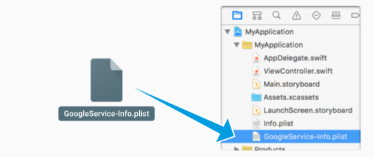

# ChatApp-UIKit

Frontend of iOS for Technovation app for SLP

## **Setup**

After downloading the repository, you need to do the next configurations 

### **Cocoapods configuration**

Download and install cocoapods 

```sudo gem install cocoapods```

After of installation of cocoapods. You can install project dependencies with the command

```pod install```

With the dependencies installed, now you should use the file **teckers.xcworkspace**  to run the project.

### **Firebase configuration** 

If you don't have a project in firebase. you will need to add one to the https://console.firebase.google.com

Once you have created project in firebase. You need to add an app in iOS. This app generates a file called **Google-services.plist**. Download this file and add it to the project. 


